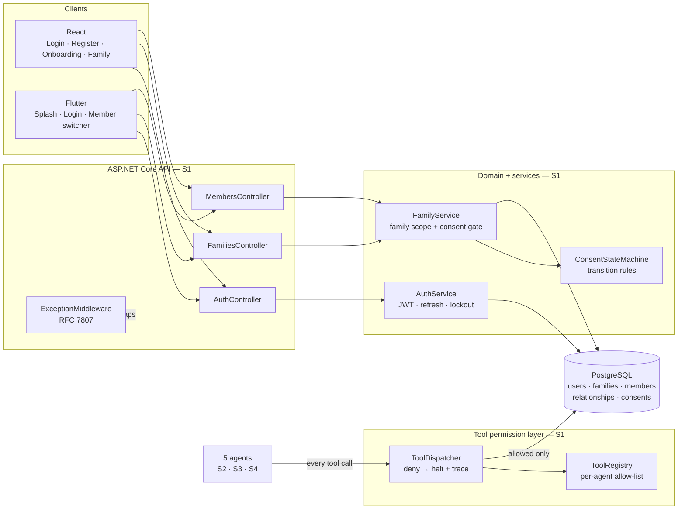
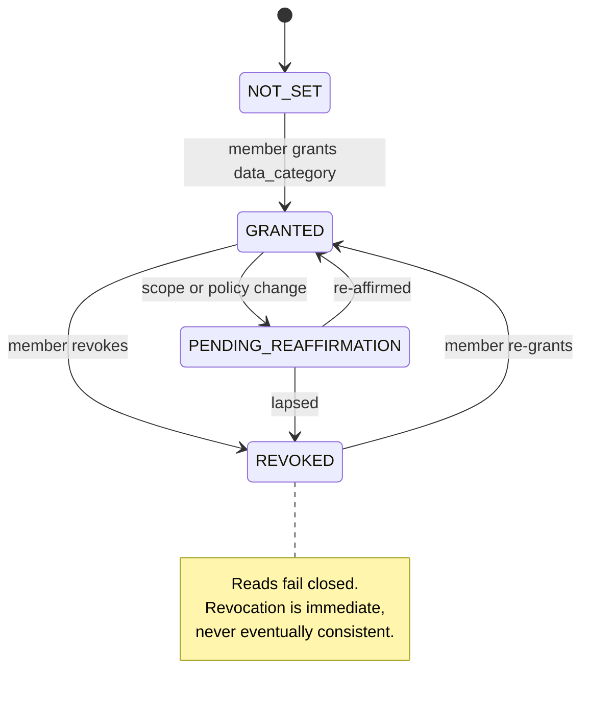
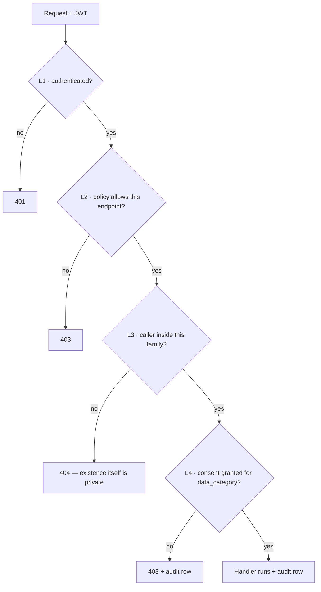
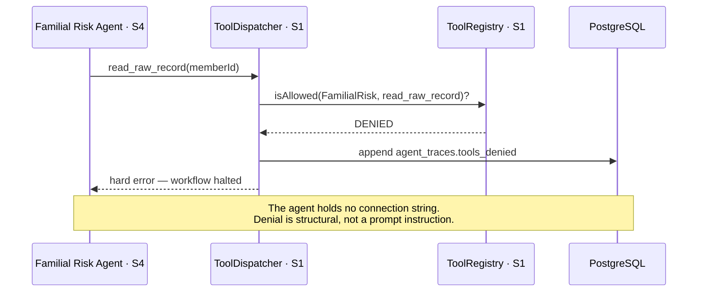

# Individual Report — S1

**Name:** Samaranayaka S.G.V.S · **IT number:** IT23544154
**Component:** Family, Identity & Consent
**Additional responsibilities:** CI pipeline · JWT policies · **tool-permission enforcement layer**

> Update every Sunday, 15 minutes, from W1. Do not leave this to W8.

## 1. ASP.NET Core REST API (10)

Endpoints owned: `/auth/*` `/families/*` `/members/*` `/consents/*`

_What I built, the DTO and validation approach, status code choices, exception middleware._

## 2. PostgreSQL and data modelling (10)

Tables owned: `users` `families` `members` `relationships` `consents`

_Schema decisions, constraints (`UNIQUE(member_id, data_category)`, `CHECK (member_id <> related_member_id)`, `is_biological NOT NULL`), indexes, migrations I authored._

## 3. React web application (10)

Screens owned: Login/Register · Family Management · Consent Management

_Components, protected routes and role guards, loading/empty/error states, client validation._

## 4. Flutter mobile application (10)

Screens owned: Onboarding/Login · Family Setup · Member Switcher · Consent Settings

_Widgets, `go_router` redirect guards, `flutter_secure_storage` token handling._

## 5. Agentic AI contribution (12)

**I own no individual agent. My agentic contribution is the tool-permission enforcement layer that every agent depends on, plus the CI pipeline.**

`ToolRegistry` and `ToolDispatcher` implement the per-agent allow-list. Enforcement is at dispatch, not in the prompt: a denied call returns a hard error, writes to `agent_traces.tools_denied`, and halts the workflow. Without this layer, the tool permission matrix would be advisory text rather than an enforced boundary — and the Familial Risk Agent's raw-record denial, which is the project's central privacy claim, would be unprovable.

_Design, the registry structure, the denial path, the tests, the live demonstration._

## 6. API integration, security, cross-platform (10)

_The four authorisation layers; consent enforcement; family scope; JWT policy design; rate limiting; my part of the cross-platform workflow._

## 7. Testing, CI and Git workflow (8)

_`AuthFlowTests`, `ConsentEnforcementTests`, unit tests for `AuthService`/`FamilyService`/`ConsentService`, coverage figure, `.github/workflows/ci.yml`, PR reviews given, `git log --author` summary._

## 8. Personal reflection

> **Write this yourself. Never AI-generated — an AI-generated reflection receives no credit.**

_What was hardest, what you got wrong first, what you would do differently, what building an enforced permission boundary taught you._

---

## 9. Component map and flows

### 9.1 What I own, end to end

**Read this diagram as the answer to "what did S1 build".** The agents never touch `DB` directly — every arrow from `AG` passes through `TD`. That is invariant 5.

### 9.2 Consent state machine — `ConsentStateMachine.cs`

Constraint that makes this enforceable: `UNIQUE(member_id, data_category)` — one row per member per category, so "the current consent" is never ambiguous.

### 9.3 The four authorisation layers

Layer 3 returning **404 rather than 403** is deliberate: a 403 would confirm the family exists.

### 9.4 Tool denial — my §5 evidence, in one picture

---

## 10. Daily push plan — 10 Aug → 29 Sep 2026

### Rules

| | |
|---|---|
| **Branch** | `feature/s1-consent-management` → PR into `develop` |
| **Identity** | `git config user.name "Samaranayaka S.G.V.S"` / `user.email` = my own GitHub account. **Every commit below is pushed by me and nobody else** — §7 of my marks is `git log --author` output |
| **Push cadence** | End of every working day: `git push origin feature/s1-consent-management`. A day with no push is a day with no evidence |
| **Commit format** | `type(s1): imperative summary` — `feat` `fix` `test` `docs` `ci` `refactor` |
| **Shared files** | `Program.cs`, `AppDbContext.cs`, `DependencyInjection.cs`, `ci.yml` are `⚠ SHARED` — add inside my labelled block only, never reorder |
| **Migrations** | Announce the migration lock in the group chat first. See CLAUDE.md → Migration protocol |
| **Sat** | Standing: review a teammate's PR, merge my own, confirm `develop` still builds |
| **Sun** | Standing: 15 min — update `docs/individual-reports/S1.md` and `docs/ai-disclosure/S1.md`, then push |

### W2 · Skeleton — gate: CI green

| Date | Files to stage | Commit message |
|---|---|---|
| Mon 10 Aug | `backend/src/Domain/Identity/IdentityEntities.cs` `backend/src/Infrastructure/Persistence/Configurations/IdentityConfigurations.cs` | `feat(s1): add identity and family domain entities` |
| Tue 11 Aug | `backend/src/Infrastructure/Auth/JwtOptions.cs` `backend/src/Infrastructure/Auth/AuthService.cs` `backend/src/Application/Auth/AuthContracts.cs` | `feat(s1): issue and validate JWT access tokens` |
| Wed 12 Aug | `backend/src/Api/Controllers/AuthController.cs` `backend/src/Api/Security/HttpCurrentUser.cs` `backend/src/Api/Middleware/ExceptionMiddleware.cs` | `feat(s1): expose auth endpoints with RFC 7807 errors` |
| Thu 13 Aug | `.github/workflows/ci.yml` | `ci(s1): build, test and lint every push and PR` |

### W3 · Core CRUD — gate: every endpoint 2xx in Swagger

| Date | Files to stage | Commit message |
|---|---|---|
| Fri 14 Aug | `backend/src/Application/Families/FamilyContracts.cs` `backend/src/Application/Common/ICurrentUser.cs` `backend/src/Application/Common/PagedResult.cs` | `feat(s1): define family and member contracts` |
| Sat 15 Aug | — | *standing: PR review + merge* |
| Sun 16 Aug | `docs/individual-reports/S1.md` · `docs/ai-disclosure/S1.md` | `docs(s1): record week 3 progress and AI use` |
| Mon 17 Aug | `backend/src/Infrastructure/Families/FamilyService.cs` | `feat(s1): scope family and member reads to the caller family` |
| Tue 18 Aug | `backend/src/Api/Controllers/FamiliesController.cs` `backend/src/Api/Controllers/MembersController.cs` | `feat(s1): expose family and member endpoints` |
| Wed 19 Aug | `backend/src/Domain/Consent/ConsentStateMachine.cs` | `feat(s1): add the consent state machine` |
| Thu 20 Aug | ⚠ **migration lock** — `backend/src/Infrastructure/Persistence/Migrations/*_S1_*` `backend/src/Infrastructure/Persistence/AppDbContext.cs` | `feat(s1): add identity, family and consent tables` |

### W4 · Frontend wiring — gate: end-to-end login on both platforms

| Date | Files to stage | Commit message |
|---|---|---|
| Fri 21 Aug | `web/src/services/apiClient.ts` `web/src/store/index.ts` · `web/src/store/hooks.ts` | `feat(s1): add typed API client and Redux store` |
| Sat 22 Aug | — | *standing: PR review + merge* |
| Sun 23 Aug | `docs/individual-reports/S1.md` · `docs/ai-disclosure/S1.md` | `docs(s1): record week 4 progress and AI use` |
| Mon 24 Aug | `web/src/store/slices/authSlice.ts` `web/src/pages/auth/LoginPage.tsx` · `RegisterPage.tsx` | `feat(s1): add web login and registration` |
| Tue 25 Aug | `web/src/routes/RouteGuard.tsx` · `web/src/routes/AppRouter.tsx` `web/src/pages/auth/DoctorRegisterPage.tsx` | `feat(s1): guard web routes by role and verification state` |
| Wed 26 Aug | `web/src/pages/family/OnboardingPage.tsx` `web/src/pages/family/FamilyPage.tsx` | `feat(s1): add family onboarding and consent screens` |
| Thu 27 Aug | `mobile/lib/services/storage/secure_token_store.dart` `mobile/lib/providers/auth_provider.dart` · `core_providers.dart` `mobile/lib/screens/auth/login_screen.dart` · `splash_screen.dart` `mobile/lib/router/app_router.dart` | `feat(s1): add mobile auth with secure token storage` |

### W5 · Agents I — my dispatch layer · **scope freeze**

| Date | Files to stage | Commit message |
|---|---|---|
| Fri 28 Aug | `mobile/lib/screens/family/members_screen.dart` `mobile/lib/providers/active_member_provider.dart` `mobile/lib/services/storage/member_preference_store.dart` | `feat(s1): add member switcher with persisted selection` |
| Sat 29 Aug | — | *standing: PR review + merge* |
| Sun 30 Aug | `docs/individual-reports/S1.md` · `docs/ai-disclosure/S1.md` | `docs(s1): record week 5 progress and AI use` |
| Mon 31 Aug | `backend/src/Application/Agents/ToolRegistry.cs` | `feat(s1): define the per-agent tool allow-list` |
| Tue 1 Sep | `backend/src/Infrastructure/Agents/ToolDispatcher.cs` | `feat(s1): enforce the tool allow-list at dispatch` |
| Wed 2 Sep | `backend/tests/UnitTests/ToolRegistryTests.cs` `backend/tests/UnitTests/ToolDispatcherTests.cs` | `test(s1): cover allow-list enforcement and the denial path` |
| Thu 3 Sep | `docs/PERMISSIONS.md` `docs/diagrams/consent-state-machine.mmd` | `docs(s1): document the tool permission matrix` |

### W6 · Agents II — gate: full workflow runs

| Date | Files to stage | Commit message |
|---|---|---|
| Fri 4 Sep | `mobile/lib/services/storage/logout_cleanup_marker_store.dart` `mobile/lib/services/api/api_client.dart` · `auth_api.dart` | `fix(s1): clear every auth artefact on mobile logout` |
| Sat 5 Sep | — | *standing: PR review + merge* |
| Sun 6 Sep | `docs/individual-reports/S1.md` · `docs/ai-disclosure/S1.md` | `docs(s1): record week 6 progress and AI use` |
| Mon 7 Sep | `backend/tests/UnitTests/ConsentStateMachineTests.cs` | `test(s1): cover consent transitions and revocation` |
| Tue 8 Sep | `backend/tests/UnitTests/FamilyServicePrivacyTests.cs` | `test(s1): assert cross-family reads return 404` |
| Wed 9 Sep | `backend/tests/IntegrationTests/AuthAndPatientFlowTests.cs` | `test(s1): cover register, login and consent end to end` |
| Thu 10 Sep | `web/src/store/slices/authSlice.test.ts` `web/src/routes/AppRouter.test.tsx` `web/src/pages/family/OnboardingPage.test.tsx` | `test(s1): cover the web auth slice and route guards` |

### W7 · Integration and quality

| Date | Files to stage | Commit message |
|---|---|---|
| Fri 11 Sep | `mobile/test/providers/auth_provider_test.dart` · `active_member_provider_test.dart` `mobile/test/router/route_guard_test.dart` `mobile/test/services/secure_storage_test.dart` | `test(s1): cover mobile guards and secure storage` |
| Sat 12 Sep | — | *standing: PR review + merge* |
| Sun 13 Sep | `docs/individual-reports/S1.md` · `docs/ai-disclosure/S1.md` | `docs(s1): record week 7 progress and AI use` |
| Mon 14 Sep | `backend/src/Api/Program.cs` *(S1 labelled block)* | `feat(s1): rate limit the auth endpoints` |
| Tue 15 Sep | `backend/src/Application/Validation/RequestValidators.cs` | `fix(s1): tighten validation on auth and family payloads` |
| Wed 16 Sep | `docs/PERMISSIONS.md` · `.env.example` | `docs(s1): record the four authorisation layers` |
| Thu 17 Sep | `.github/workflows/ci.yml` | `ci(s1): fail the build below 80 percent service coverage` |

### W8 · Deploy and document — gate: reachable by the evaluator

| Date | Files to stage | Commit message |
|---|---|---|
| Fri 18 Sep | `render.yaml` · `backend/Dockerfile` *(S1 block)* | `ci(s1): pin the API deployment build` |
| Sat 19 Sep | — | *standing: PR review + merge* |
| Sun 20 Sep | `docs/individual-reports/S1.md` · `docs/ai-disclosure/S1.md` | `docs(s1): record week 8 progress and AI use` |
| Mon 21 Sep | `docs/individual-reports/S1.md` §1–§4 | `docs(s1): complete report sections 1 to 4 with evidence` |
| Tue 22 Sep | `docs/individual-reports/S1.md` §5–§7 + `git log --author` output | `docs(s1): complete report sections 5 to 7 with evidence` |
| Wed 23 Sep | `docs/ai-disclosure/S1.md` | `docs(s1): finalise the AI use disclosure log` |
| Thu 24 Sep | `docs/diagrams/consent-state-machine.svg` + `.mmd` source | `docs(s1): export the consent and permission diagrams` |

### W9 · Freeze and viva — submit 29 Sep

| Date | Files to stage | Commit message |
|---|---|---|
| Fri 25 Sep | own files only — final defect fixes | `fix(s1): <specific defect>` |
| **Sat 26 Sep** | **CODE FREEZE — last code push of the project** | `chore(s1): freeze the identity and permission layer` |
| Sun 27 Sep | `docs/VIVA_PREP.md` *(S1 block)* — mock viva 1 | `docs(s1): add viva answers for the permission layer` |
| Mon 28 Sep | `docs/individual-reports/S1.md` §8 — **written by me, not AI** — mock viva 2 | `docs(s1): add personal reflection` |
| **Tue 29 Sep** | **SUBMIT.** Verify `git log --author="Samaranayaka" --oneline \| wc -l` shows daily commits across all eight weeks | — |
| Wed 30 Sep | Deadline. No pushes — buffer day only | — |
