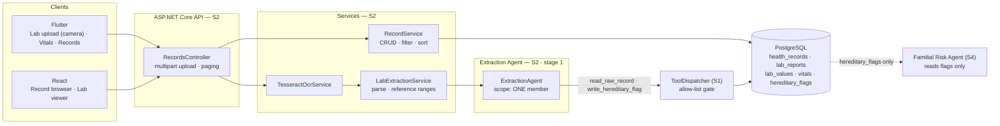
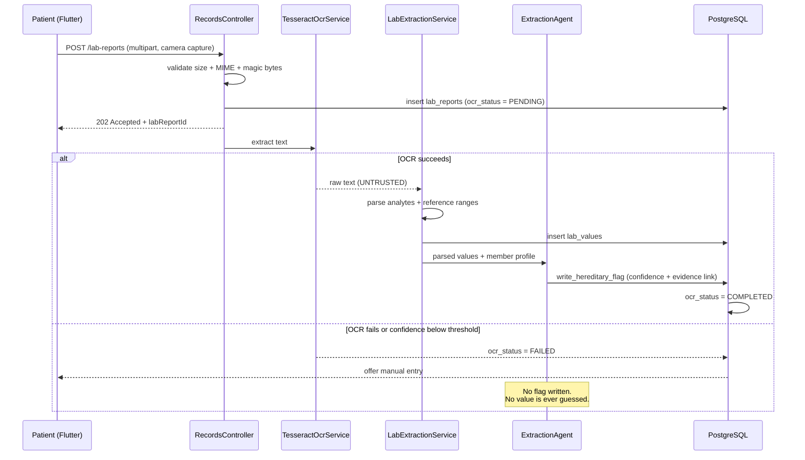
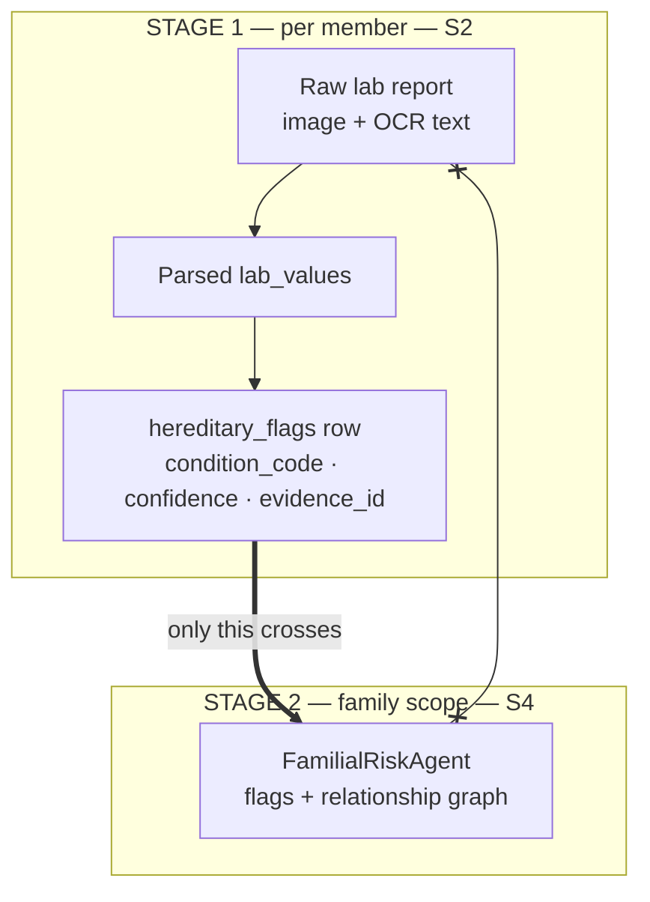

# Individual Report — S2

**Name:** Fernando K.R.N · **IT number:** IT24101875
**Component:** Health Records & Extraction
**Additional responsibilities:** OCR pipeline · file storage · synthetic seed data

> Update every Sunday, 15 minutes, from W1. Do not leave this to W8.

## 1. ASP.NET Core REST API (10)

Endpoints owned: `/records/*` `/lab-reports/*` `/vitals/*` `/hereditary-flags`

_Multipart upload handling, paging/filtering/sorting on the record list, DTOs, validation, status codes._

## 2. PostgreSQL and data modelling (10)

Tables owned: `health_records` `lab_reports` `lab_values` `vitals` `hereditary_flags`

_Schema decisions, `idx_vitals_member_time` (the baseline query index), `idx_labvalues_analyte` (trend queries), `UNIQUE(member_id, condition_code)`, migrations I authored, the synthetic demo family seed._

## 3. React web application (10)

Screens owned: Record Browser · Lab Report Viewer (parsed values, reference ranges, trend chart)

_Search, filter, sort, pagination; out-of-range rendering by colour **and** icon; states._

## 4. Flutter mobile application (10)

Screens owned: **Upload Lab Report (camera — the device feature)** · Record Vitals · Records List

_Camera/image picker integration, permission handling, upload progress, offline error handling._

## 5. Agentic AI contribution (12)

**Extraction Agent** — Stage 1 of the two-stage model (ADR-003).

Runs on lab report upload, scoped to **one member**. OCR → parse → identify hereditary-relevant findings → write a structured `hereditary_flags` row. **Raw record content never leaves this stage.** Tools: `read_member_profile`, `read_raw_record`, `ocr_extract`, `write_hereditary_flag`.

_Prompt and schema design, confidence scoring, the enforceable `lab_report_id` / `health_record_id` evidence links, the OCR failure path (`ocr_status = FAILED`, manual entry offered, **no guessed values**)._

## 6. API integration, security, cross-platform (10)

_File storage security, upload size and type validation, treating OCR text as untrusted input, my part of the cross-platform workflow (camera capture → flag → familial signal)._

## 7. Testing, CI and Git workflow (8)

_`ExtractionAgentTests`, unit tests for `RecordService`/`VitalsTrendService`, OCR failure tests, coverage figure, PR reviews given, `git log --author` summary._

## 8. Personal reflection

> **Write this yourself. Never AI-generated — an AI-generated reflection receives no credit.**

_What was hardest, what OCR accuracy on real layouts taught you, what you would do differently._

---

## 9. Component map and flows

### 9.1 What I own, end to end

The dotted arrow is the whole point of ADR-003: **S4 receives my structured flags, never my raw record text.**

### 9.2 Upload → flag pipeline, including the failure path

### 9.3 Stage 1 of the two-stage model — where my boundary sits

`x--x` is the denied path: `read_raw_record` is not on S4's allow-list, and the denial is enforced in `ToolDispatcher`, not in a prompt.

---

## 10. Daily push plan — 10 Aug → 29 Sep 2026

### Rules

| | |
|---|---|
| **Branch** | `feature/s2-lab-ocr-extraction` → PR into `develop` |
| **Identity** | `git config user.name "Fernando K.R.N"` / `user.email` = my own GitHub account. **Every commit below is pushed by me and nobody else** — §7 of my marks is `git log --author` output |
| **Push cadence** | End of every working day: `git push origin feature/s2-lab-ocr-extraction` |
| **Commit format** | `type(s2): imperative summary` |
| **Shared files** | `Program.cs`, `AppDbContext.cs`, `DependencyInjection.cs`, `DatabaseInitializer.cs` are `⚠ SHARED` — my labelled block only |
| **Migrations** | Announce the migration lock before `dotnet ef migrations add`. Never two in flight |
| **Safety** | OCR text is **untrusted input** — validated before it reaches the agent. No drug names, no dosing, no interpretation of results anywhere in my code or seed data |
| **Sat** | Standing: review a teammate's PR, merge my own, confirm `develop` still builds |
| **Sun** | Standing: 15 min — update `docs/individual-reports/S2.md` and `docs/ai-disclosure/S2.md`, then push |

### W2 · Skeleton — gate: CI green

| Date | Files to stage | Commit message |
|---|---|---|
| Mon 10 Aug | `backend/src/Domain/Records/RecordEntities.cs` | `feat(s2): add health record and lab report entities` |
| Tue 11 Aug | `backend/src/Infrastructure/Persistence/Configurations/RecordConfigurations.cs` | `feat(s2): configure record tables, indexes and constraints` |
| Wed 12 Aug | `backend/src/Application/Records/RecordContracts.cs` | `feat(s2): define record, vital and lab DTOs` |
| Thu 13 Aug | `docs/DATABASE.md` *(S2 block)* · `docs/diagrams/er-diagram.mmd` | `docs(s2): publish the ER diagram for all 20 tables` |

### W3 · Core CRUD — gate: every endpoint 2xx in Swagger

| Date | Files to stage | Commit message |
|---|---|---|
| Fri 14 Aug | `backend/src/Infrastructure/Records/RecordService.cs` | `feat(s2): add record CRUD with paging, filter and sort` |
| Sat 15 Aug | — | *standing: PR review + merge* |
| Sun 16 Aug | `docs/individual-reports/S2.md` · `docs/ai-disclosure/S2.md` | `docs(s2): record week 3 progress and AI use` |
| Mon 17 Aug | `backend/src/Api/Controllers/RecordsController.cs` | `feat(s2): expose record and vital endpoints` |
| Tue 18 Aug | `backend/src/Api/Controllers/RecordsController.cs` (multipart) | `feat(s2): accept multipart lab report upload with type checks` |
| Wed 19 Aug | `backend/src/Infrastructure/Persistence/DatabaseInitializer.cs` *(S2 block)* | `feat(s2): seed the synthetic demo family` |
| Thu 20 Aug | ⚠ **migration lock** — `backend/src/Infrastructure/Persistence/Migrations/*_S2_*` | `feat(s2): add lab report, lab value and vital tables` |

### W4 · Frontend wiring — gate: end-to-end record create on both platforms

| Date | Files to stage | Commit message |
|---|---|---|
| Fri 21 Aug | `web/src/components/shared/ListToolbar.tsx` `web/src/components/shared/Pagination.tsx` | `feat(s2): add reusable list toolbar and pagination` |
| Sat 22 Aug | — | *standing: PR review + merge* |
| Sun 23 Aug | `docs/individual-reports/S2.md` · `docs/ai-disclosure/S2.md` | `docs(s2): record week 4 progress and AI use` |
| Mon 24 Aug | `web/src/pages/records/RecordsPage.tsx` | `feat(s2): add the record browser with search and filter` |
| Tue 25 Aug | `web/src/pages/records/RecordsPage.tsx` (lab viewer) | `feat(s2): render lab values with reference ranges` |
| Wed 26 Aug | `mobile/lib/models/health_record.dart` `mobile/lib/providers/records_provider.dart` `mobile/lib/screens/records/records_screen.dart` | `feat(s2): add the mobile records list` |
| Thu 27 Aug | `mobile/lib/screens/records/lab_upload_screen.dart` — **device feature** `mobile/lib/screens/records/vital_entry_screen.dart` · `record_entry_screen.dart` | `feat(s2): capture lab reports with the device camera` |

### W5 · Agents I — Extraction Agent · **scope freeze**

| Date | Files to stage | Commit message |
|---|---|---|
| Fri 28 Aug | `mobile/lib/services/api/patient_api.dart` *(S2 block)* | `feat(s2): upload lab images with progress and retry` |
| Sat 29 Aug | — | *standing: PR review + merge* |
| Sun 30 Aug | `docs/individual-reports/S2.md` · `docs/ai-disclosure/S2.md` | `docs(s2): record week 5 progress and AI use` |
| Mon 31 Aug | `backend/src/Infrastructure/Records/TesseractOcrService.cs` | `feat(s2): add OCR extraction with an explicit failure state` |
| Tue 1 Sep | `backend/src/Infrastructure/Records/LabExtractionService.cs` | `feat(s2): parse analytes and reference ranges from OCR text` |
| Wed 2 Sep | `backend/src/Infrastructure/Agents/ExtractionAgent.cs` | `feat(s2): add the extraction agent for hereditary flags` |
| Thu 3 Sep | `docs/AGENTS_DESIGN.md` *(S2 block)* · `docs/adr/ADR-003-two-stage-familial-model.md` | `docs(s2): document stage 1 of the two-stage model` |

### W6 · Agents II — gate: full workflow runs

| Date | Files to stage | Commit message |
|---|---|---|
| Fri 4 Sep | `backend/src/Infrastructure/Agents/ExtractionAgent.cs` | `feat(s2): link every flag to its evidence record id` |
| Sat 5 Sep | — | *standing: PR review + merge* |
| Sun 6 Sep | `docs/individual-reports/S2.md` · `docs/ai-disclosure/S2.md` | `docs(s2): record week 6 progress and AI use` |
| Mon 7 Sep | `backend/tests/UnitTests/LabExtractionParserTests.cs` | `test(s2): cover analyte parsing and range detection` |
| Tue 8 Sep | `backend/tests/UnitTests/LabExtractionSafetyTests.cs` | `test(s2): reject prompt injection carried in OCR text` |
| Wed 9 Sep | `backend/tests/UnitTests/RecordServiceLabReviewTests.cs` | `test(s2): cover the OCR failure and manual entry path` |
| Thu 10 Sep | `backend/src/Infrastructure/Records/RecordService.cs` | `fix(s2): enforce upload size and MIME allow-list` |

### W7 · Integration and quality

| Date | Files to stage | Commit message |
|---|---|---|
| Fri 11 Sep | `mobile/test/services/api_services_test.dart` *(S2 cases)* | `test(s2): cover mobile upload and offline failure` |
| Sat 12 Sep | — | *standing: PR review + merge* |
| Sun 13 Sep | `docs/individual-reports/S2.md` · `docs/ai-disclosure/S2.md` | `docs(s2): record week 7 progress and AI use` |
| Mon 14 Sep | `web/src/pages/records/RecordsPage.tsx` | `fix(s2): flag out-of-range values by colour and icon` |
| Tue 15 Sep | `backend/src/Application/Validation/RequestValidators.cs` *(S2 block)* | `fix(s2): validate vital ranges and record payloads` |
| Wed 16 Sep | `backend/src/Infrastructure/Persistence/DatabaseInitializer.cs` | `fix(s2): expand the synthetic seed to cover every demo path` |
| Thu 17 Sep | `docs/TESTING.md` *(S2 block)* | `docs(s2): record coverage for the record and OCR layer` |

### W8 · Deploy and document — gate: reachable by the evaluator

| Date | Files to stage | Commit message |
|---|---|---|
| Fri 18 Sep | `backend/Dockerfile` *(S2 block — Tesseract data)* | `ci(s2): ship OCR language data in the API image` |
| Sat 19 Sep | — | *standing: PR review + merge* |
| Sun 20 Sep | `docs/individual-reports/S2.md` · `docs/ai-disclosure/S2.md` | `docs(s2): record week 8 progress and AI use` |
| Mon 21 Sep | `docs/individual-reports/S2.md` §1–§4 | `docs(s2): complete report sections 1 to 4 with evidence` |
| Tue 22 Sep | `docs/individual-reports/S2.md` §5–§7 + `git log --author` output | `docs(s2): complete report sections 5 to 7 with evidence` |
| Wed 23 Sep | `docs/ai-disclosure/S2.md` | `docs(s2): finalise the AI use disclosure log` |
| Thu 24 Sep | `docs/diagrams/er-diagram.svg` + `.mmd` source | `docs(s2): export the ER and extraction pipeline diagrams` |

### W9 · Freeze and viva — submit 29 Sep

| Date | Files to stage | Commit message |
|---|---|---|
| Fri 25 Sep | own files only — final defect fixes | `fix(s2): <specific defect>` |
| **Sat 26 Sep** | **CODE FREEZE — last code push of the project** | `chore(s2): freeze the records and extraction layer` |
| Sun 27 Sep | `docs/VIVA_PREP.md` *(S2 block)* — mock viva 1 | `docs(s2): add viva answers for the extraction agent` |
| Mon 28 Sep | `docs/individual-reports/S2.md` §8 — **written by me, not AI** — mock viva 2 | `docs(s2): add personal reflection` |
| **Tue 29 Sep** | **SUBMIT.** Verify `git log --author="Fernando" --oneline \| wc -l` shows daily commits across all eight weeks | — |
| Wed 30 Sep | Deadline. No pushes — buffer day only | — |
