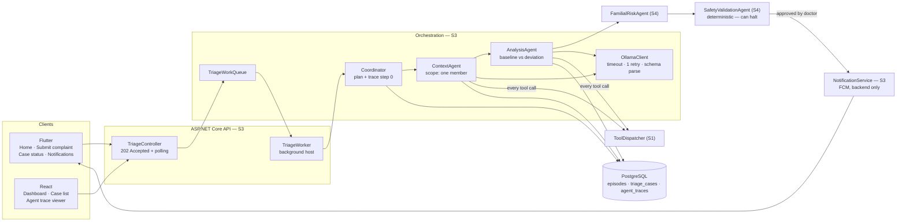
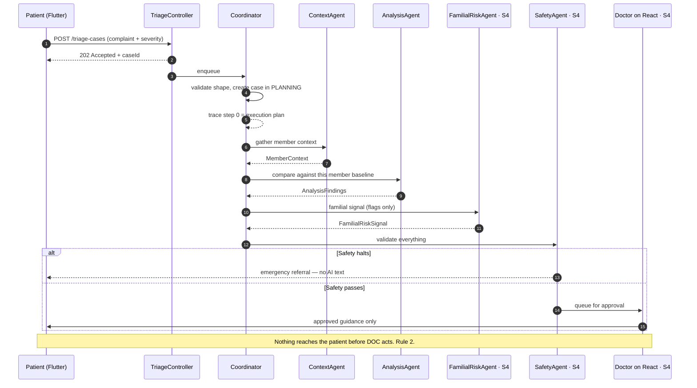
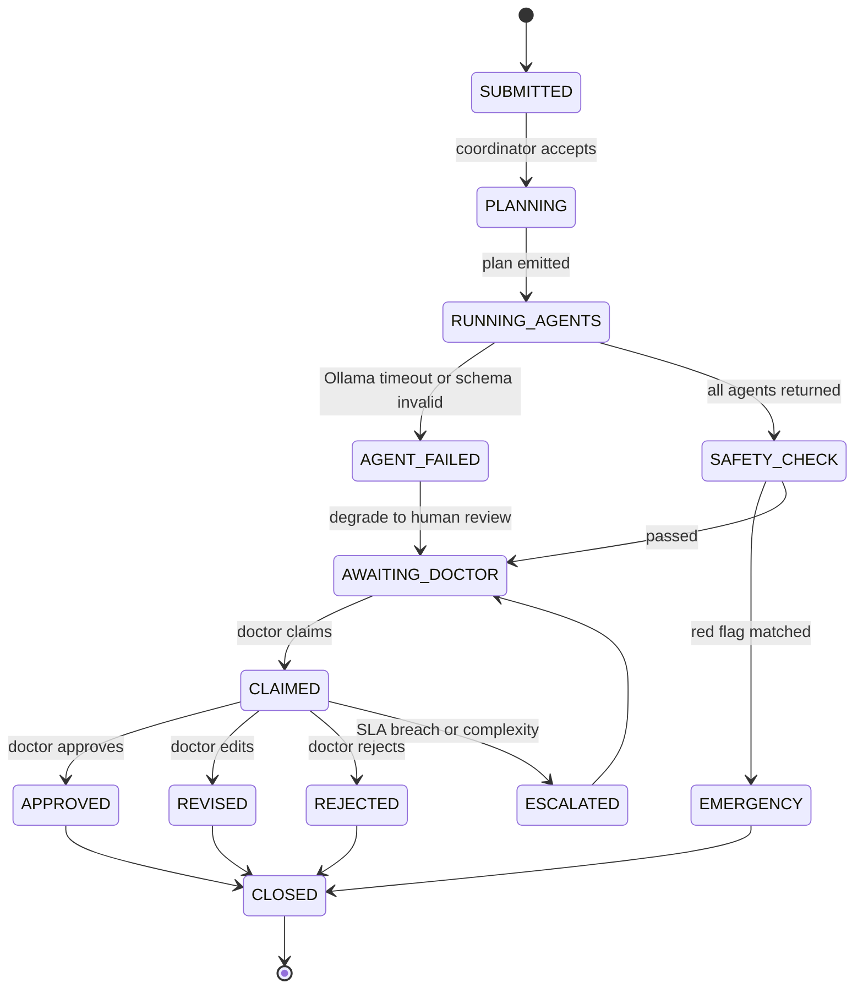
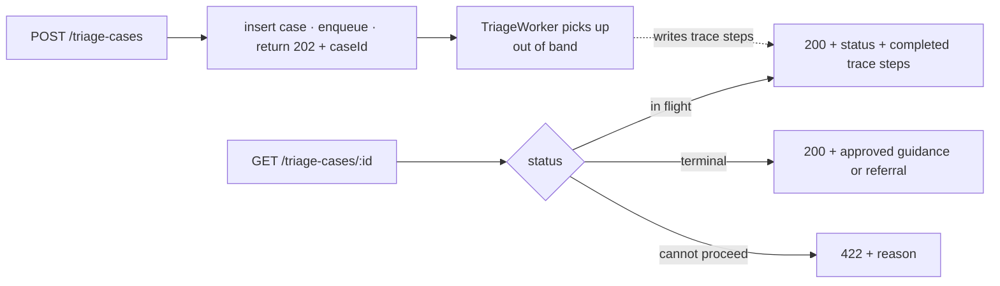

# Individual Report — S3

**Name:** Karunathilaka K.D.J.C · **IT number:** IT24100551 · **Group Leader**
**Component:** Triage & Agent Orchestration
**Additional responsibilities:** notification service · tool dispatch integration · submission

> Update every Sunday, 15 minutes, from W1. Do not leave this to W8.

## 1. ASP.NET Core REST API (10)

Endpoints owned: `/episodes/*` `/triage-cases/*` `/dashboard` `/notifications/*`

_The 202-Accepted pattern for the long-running workflow, polling endpoint design, DTOs, validation, status codes including 422 when the workflow cannot proceed._

## 2. PostgreSQL and data modelling (10)

Tables owned: `episodes` `triage_cases` `agent_traces`

_The status enum and its transitions, `UNIQUE(triage_case_id, step_number)`, `idx_cases_status_priority`, `jsonb` choices for agent outputs, migrations I authored._

## 3. React web application (10)

Screens owned: Family Health Dashboard · Case List · **Agent Trace Viewer** · System Reports

_The trace viewer: step-by-step rendering, tools requested/allowed/**denied**, confidence, latency, tokens. Filter/sort/paginate on the case list._

## 4. Flutter mobile application (10)

Screens owned: Home/Member Summary · Submit Complaint · Case Status Tracker · Notifications

_Symptom picker, severity slider, the status stepper mirroring the state machine exactly, push notification handling and deep linking._

## 5. Agentic AI contribution (12)

**Coordinator/Planner, Context Agent, Analysis Agent** — three of the five agents.

- **Coordinator** validates the request shape, creates the `TriageCase` in `PLANNING`, produces an ordered execution plan, emits trace step 0.
- **Context Agent** — scope one member. Tools: `read_member_profile`, `read_member_vitals`, `read_member_episodes`, `read_member_conditions`. Output `MemberContext`.
- **Analysis Agent** — scope one member. Tools: `read_lab_trends`, `compute_deviation`. Output `AnalysisFindings`: is this complaint consistent with this person's own baseline, or a deviation?

Also: `OllamaClient` (timeout, one retry, structured output parsing) and full trace persistence — input hash, tools, output, schema validity, confidence, latency, tokens.

_Why Context and Analysis are genuinely distinct agents rather than one; the safe-failure path when Ollama is unavailable._

## 6. API integration, security, cross-platform (10)

_Third-party notification service integrated **through the backend only** (invariant 4); device token handling; end-to-end ownership of the cross-platform workflow from complaint to approved guidance._

## 7. Testing, CI and Git workflow (8)

_`TriageWorkflowTests`, safe-failure tests with a stubbed `IOllamaClient`, unit tests for `EpisodeService`, coverage figure, PR reviews given, `git log --author` summary._

## 8. Personal reflection

> **Write this yourself. Never AI-generated — an AI-generated reflection receives no credit.**

_What was hardest, what orchestrating four agents taught you, what leading the group taught you, what you would do differently._

---

## 9. Component map and flows

### 9.1 What I own, end to end

Invariant 4 lives on the `NS` node: **no client ever calls FCM.** The arrow into FCM starts inside the backend.

### 9.2 The workflow, step by step

### 9.3 Triage case state machine — `TriageEntities.cs`

`AGENT_FAILED` never terminates the case — it degrades to human review. That is Rule 9 expressed as a transition.

### 9.4 202-Accepted polling — why the API does not block

---

## 10. Daily push plan — 10 Aug → 29 Sep 2026

### Rules

| | |
|---|---|
| **Branch** | `feature/s3-agent-orchestration` → PR into `develop` |
| **Identity** | `git config user.name "Karunathilaka K.D.J.C"` / `user.email` = my own GitHub account. **Every commit below is pushed by me and nobody else** — §7 of my marks is `git log --author` output |
| **Push cadence** | End of every working day: `git push origin feature/s3-agent-orchestration` |
| **Commit format** | `type(s3): imperative summary` |
| **Shared files** | `Program.cs`, `AppDbContext.cs`, `DependencyInjection.cs` are `⚠ SHARED` — my labelled block only |
| **Leader duty** | As group leader I also run the Monday and Thursday rituals — but I never commit on another member's behalf. Their marks depend on their own history |
| **Safety** | Agent output is untrusted until the S4 safety agent validates it. No agent output is ever rendered to a patient before doctor approval |
| **Sat** | Standing: review a teammate's PR, merge my own, confirm `develop` still builds |
| **Sun** | Standing: 15 min — update `docs/individual-reports/S3.md` and `docs/ai-disclosure/S3.md`, then push |

### W2 · Skeleton — gate: CI green

| Date | Files to stage | Commit message |
|---|---|---|
| Mon 10 Aug | `backend/src/Domain/Triage/TriageEntities.cs` | `feat(s3): add episode, triage case and trace entities` |
| Tue 11 Aug | `backend/src/Infrastructure/Persistence/Configurations/TriageConfigurations.cs` | `feat(s3): configure triage tables, enums and indexes` |
| Wed 12 Aug | `backend/src/Application/Triage/TriageContracts.cs` | `feat(s3): define triage request and status DTOs` |
| Thu 13 Aug | `docs/diagrams/architecture.mmd` · `docs/diagrams/agent-workflow.mmd` `docs/diagrams/triage-state-machine.mmd` | `docs(s3): publish architecture and workflow diagrams` |

### W3 · Core CRUD — gate: every endpoint 2xx in Swagger

| Date | Files to stage | Commit message |
|---|---|---|
| Fri 14 Aug | `backend/src/Infrastructure/Triage/TriageService.cs` | `feat(s3): add episode and triage case service` |
| Sat 15 Aug | — | *standing: PR review + merge* |
| Sun 16 Aug | `docs/individual-reports/S3.md` · `docs/ai-disclosure/S3.md` | `docs(s3): record week 3 progress and AI use` |
| Mon 17 Aug | `backend/src/Api/Controllers/TriageController.cs` | `feat(s3): accept triage submissions with 202 and a case id` |
| Tue 18 Aug | `backend/src/Api/Controllers/TriageController.cs` (polling + dashboard) | `feat(s3): expose case polling and the family dashboard` |
| Wed 19 Aug | `backend/src/Application/Agents/AgentContracts.cs` | `feat(s3): define the agent input and output schemas` |
| Thu 20 Aug | ⚠ **migration lock** — `backend/src/Infrastructure/Persistence/Migrations/*_S3_*` | `feat(s3): add episode, triage case and agent trace tables` |

### W4 · Frontend wiring — gate: end-to-end on both platforms

| Date | Files to stage | Commit message |
|---|---|---|
| Fri 21 Aug | `web/src/pages/dashboard/DashboardPage.tsx` | `feat(s3): add the family health dashboard` |
| Sat 22 Aug | — | *standing: PR review + merge* |
| Sun 23 Aug | `docs/individual-reports/S3.md` · `docs/ai-disclosure/S3.md` | `docs(s3): record week 4 progress and AI use` |
| Mon 24 Aug | `web/src/pages/system/SystemPages.tsx` — **agent trace viewer** | `feat(s3): render agent traces with tools allowed and denied` |
| Tue 25 Aug | `mobile/lib/models/triage_case.dart` `mobile/lib/providers/cases_provider.dart` `mobile/lib/screens/home/home_screen.dart` | `feat(s3): add the mobile member summary` |
| Wed 26 Aug | `mobile/lib/screens/triage/submit_complaint_screen.dart` `mobile/lib/widgets/shared/symptom_chip.dart` | `feat(s3): add the symptom picker and severity slider` |
| Thu 27 Aug | `mobile/lib/screens/triage/case_status_screen.dart` · `cases_screen.dart` `mobile/lib/widgets/shared/status_stepper.dart` | `feat(s3): mirror the case state machine in a status stepper` |

### W5 · Agents I — Context Agent · **scope freeze**

| Date | Files to stage | Commit message |
|---|---|---|
| Fri 28 Aug | `backend/src/Infrastructure/Agents/OllamaClient.cs` | `feat(s3): add the Ollama client with timeout and one retry` |
| Sat 29 Aug | — | *standing: PR review + merge* |
| Sun 30 Aug | `docs/individual-reports/S3.md` · `docs/ai-disclosure/S3.md` | `docs(s3): record week 5 progress and AI use` |
| Mon 31 Aug | `backend/src/Infrastructure/Triage/TriageOrchestrator.cs` — coordinator | `feat(s3): add the coordinator with an ordered execution plan` |
| Tue 1 Sep | `backend/src/Infrastructure/Agents/ContextAgent.cs` | `feat(s3): add the context agent scoped to one member` |
| Wed 2 Sep | `backend/src/Infrastructure/Triage/TriageWorkQueue.cs` `backend/src/Api/Background/TriageWorker.cs` | `feat(s3): run the workflow out of band on a hosted worker` |
| Thu 3 Sep | `docs/AGENTS_DESIGN.md` *(S3 block)* | `docs(s3): document the coordinator and context agent` |

### W6 · Agents II — gate: full workflow runs end to end

| Date | Files to stage | Commit message |
|---|---|---|
| Fri 4 Sep | `backend/src/Infrastructure/Agents/AnalysisAgent.cs` | `feat(s3): add the analysis agent for baseline deviation` |
| Sat 5 Sep | — | *standing: PR review + merge* |
| Sun 6 Sep | `docs/individual-reports/S3.md` · `docs/ai-disclosure/S3.md` | `docs(s3): record week 6 progress and AI use` |
| Mon 7 Sep | `backend/src/Infrastructure/Triage/TriageOrchestrator.cs` | `feat(s3): persist a full trace step for every agent` |
| Tue 8 Sep | `backend/src/Infrastructure/Triage/NotificationService.cs` `backend/src/Infrastructure/Triage/FcmPushNotificationClient.cs` | `feat(s3): send push notifications from the backend only` |
| Wed 9 Sep | `mobile/lib/providers/notifications_provider.dart` · `push_registration_provider.dart` `mobile/lib/models/app_notification.dart` `mobile/lib/screens/notifications/notifications_screen.dart` | `feat(s3): register device tokens and deep link notifications` |
| Thu 10 Sep | `backend/tests/UnitTests/OllamaClientTests.cs` | `test(s3): cover LLM timeout, retry and malformed output` |

### W7 · Integration and quality

| Date | Files to stage | Commit message |
|---|---|---|
| Fri 11 Sep | `backend/tests/UnitTests/TriageOrchestratorSchemaTests.cs` | `test(s3): reject agent output that fails schema validation` |
| Sat 12 Sep | — | *standing: PR review + merge* |
| Sun 13 Sep | `docs/individual-reports/S3.md` · `docs/ai-disclosure/S3.md` | `docs(s3): record week 7 progress and AI use` |
| Mon 14 Sep | `backend/tests/UnitTests/TriageOrchestratorEmergencyTests.cs` | `test(s3): assert the emergency path outranks agent output` |
| Tue 15 Sep | `backend/tests/UnitTests/TriageWorkerRecoveryTests.cs` | `test(s3): recover in-flight cases after a worker restart` |
| Wed 16 Sep | `backend/tests/UnitTests/NotificationServiceTests.cs` | `test(s3): cover push delivery and the SMS fallback` |
| Thu 17 Sep | `mobile/test/screens/case_status_screen_test.dart` `mobile/test/providers/patient_providers_test.dart` | `test(s3): cover the mobile status stepper and providers` |

### W8 · Deploy and document — gate: reachable by the evaluator

| Date | Files to stage | Commit message |
|---|---|---|
| Fri 18 Sep | `docs/DEPLOYMENT.md` *(S3 block)* · `render.yaml` | `docs(s3): document the worker and LLM deployment topology` |
| Sat 19 Sep | — | *standing: PR review + merge* |
| Sun 20 Sep | `docs/individual-reports/S3.md` · `docs/ai-disclosure/S3.md` | `docs(s3): record week 8 progress and AI use` |
| Mon 21 Sep | `docs/individual-reports/S3.md` §1–§4 | `docs(s3): complete report sections 1 to 4 with evidence` |
| Tue 22 Sep | `docs/individual-reports/S3.md` §5–§7 + `git log --author` output | `docs(s3): complete report sections 5 to 7 with evidence` |
| Wed 23 Sep | `docs/ai-disclosure/S3.md` | `docs(s3): finalise the AI use disclosure log` |
| Thu 24 Sep | `docs/diagrams/agent-workflow.svg` · `triage-state-machine.svg` `cross-platform-workflow.svg` + `.mmd` sources | `docs(s3): export the workflow and state machine diagrams` |

### W9 · Freeze and viva — submit 29 Sep

| Date | Files to stage | Commit message |
|---|---|---|
| Fri 25 Sep | own files only — final defect fixes | `fix(s3): <specific defect>` |
| **Sat 26 Sep** | **CODE FREEZE — last code push of the project** | `chore(s3): freeze the orchestration layer` |
| Sun 27 Sep | `docs/VIVA_PREP.md` *(S3 block)* — mock viva 1, I run it | `docs(s3): add viva answers for the orchestration layer` |
| Mon 28 Sep | `docs/individual-reports/S3.md` §8 — **written by me, not AI** — mock viva 2 | `docs(s3): add personal reflection` |
| **Tue 29 Sep** | **SUBMIT** (my duty as leader). Verify all four `git log --author` histories are non-empty before submitting | — |
| Wed 30 Sep | Deadline. No pushes — buffer day only | — |
