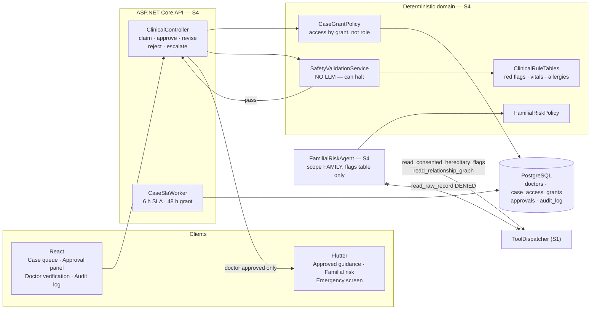
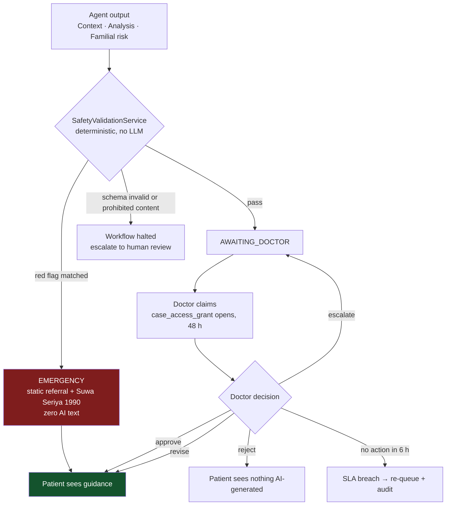
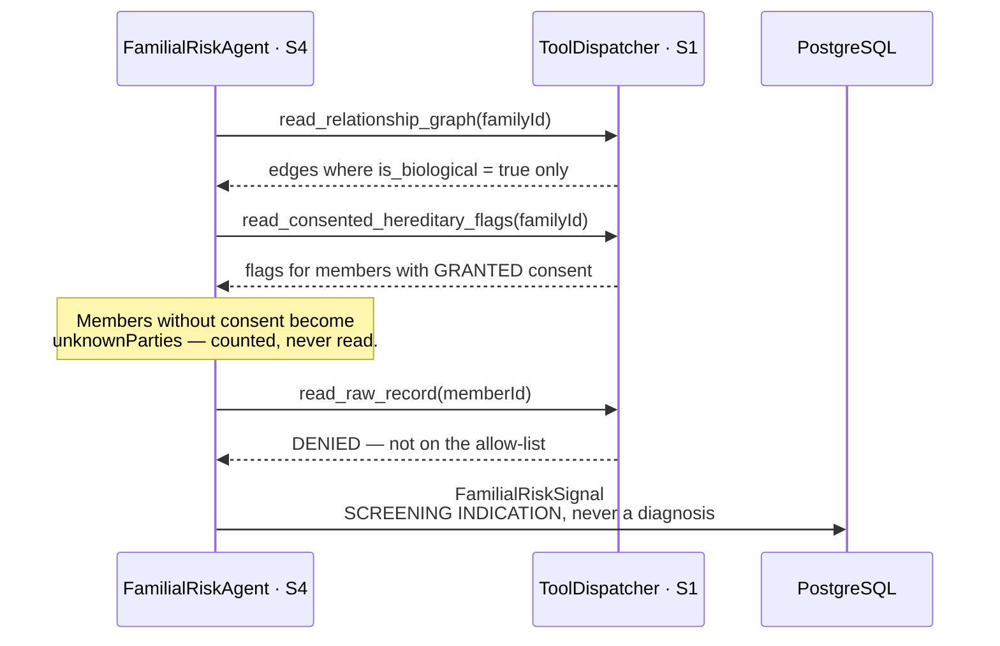
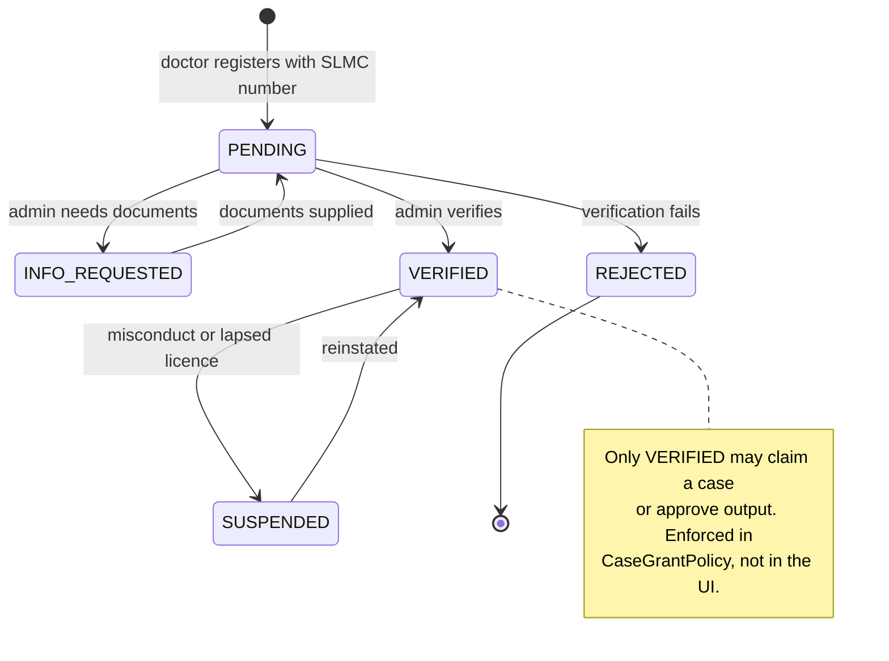

# Individual Report — S4

**Name:** W.M.S.S.B. Wasala · **IT number:** IT24100559
**Component:** Familial Risk & Clinical Approval
**Additional responsibilities:** deterministic rule tables · audit strategy · case grant model

> Update every Sunday, 15 minutes, from W1. Do not leave this to W8.

## 1. ASP.NET Core REST API (10)

Endpoints owned: `/doctors/*` `/admin/doctors/*` `/triage-cases/{id}/{claim,approve,revise,reject,escalate}` `/familial-risk` `/audit`

_DTOs, validation, 403 vs 404 policy where existence itself is private, 409 on duplicate SLMC number._

## 2. PostgreSQL and data modelling (10)

Tables owned: `doctors` `doctor_verification_log` `family_doctor_assignments` `case_access_grants` `approvals` `audit_log`

_The grant model, `idx_audit_subject_time`, the `consent_ref_id` link that turns "audited" from a claim into evidence, migrations I authored._

## 3. React web application (10)

Screens owned: Doctor Case Queue · Case Detail · **Approval Panel** · Doctor Verification Queue · Audit Log Viewer

_SLA countdown, priority filtering, the five approval actions behind confirm dialogs, the familial risk panel with caveats and `unknownParties`._

## 4. Flutter mobile application (10)

Screens owned: Approved Guidance · Familial Risk & Screening · **Emergency Screen**

_The emergency screen deliberately contains no AI-generated text: referral, Suwa Seriya 1990 one-tap call, nearest hospitals._

## 5. Agentic AI contribution (12)

**Familial Risk Agent and Safety/Validation Agent** — two of the five agents, including the only deterministic one.

- **Familial Risk Agent** — scope FAMILY but **flags table only**. Tools: `read_consented_hereditary_flags`, `read_relationship_graph`, `lookup_inheritance_pattern`. The raw-record tool is **denied at the dispatch layer** (ADR-003). Output `FamilialRiskSignal` with `unknownParties` and screening recommendations — **a screening indication, never a diagnosis**.
- **Safety/Validation Agent** — **no LLM** (ADR-007). Red-flag symptom table, age-adjusted vital ranges, allergy contraindications, duration thresholds, JSON schema validation, prohibited-content check. The only agent that can halt the workflow.

Rule tables: `RedFlagSymptoms`, `PaediatricVitalRanges`, `InheritancePatterns`, `AllergyContraindications` — cited from published clinical sources, **not AI-generated**.

_Why safety must be deterministic; how `is_biological = false` is excluded from hereditary reasoning; the emergency ordering guarantee._

## 6. API integration, security, cross-platform (10)

_Access by grant, not by role (ADR-008); the 48 h grant window and 6 h SLA; the audit strategy; my part of the cross-platform workflow (doctor approval → notification → patient)._

## 7. Testing, CI and Git workflow (8)

_`CaseGrantTests`, `ToolDenialTests`, rule table tests (table-driven), unit tests for `ApprovalService`/`DoctorVerificationService`/`AuditService`, coverage figure, PR reviews given, `git log --author` summary._

## 8. Personal reflection

> **Write this yourself. Never AI-generated — an AI-generated reflection receives no credit.**

_What was hardest, what building a deterministic safety layer inside an AI system taught you, what you would do differently._

---

## 9. Component map and flows

### 9.1 What I own, end to end

Every patient-visible arrow into `M` originates at `CC` **after** a doctor action. There is no other edge — that is invariant 6 drawn as a graph.

### 9.2 The approval gate — the only path to a patient

Note the ordering guarantee: **emergency is evaluated before anything else**, so a red-flag case never waits behind an approval queue (Rule 10).

### 9.3 Familial risk — family scope without family data

`is_biological = false` edges are excluded before inheritance reasoning starts — an adopted member contributes zero hereditary signal, by construction.

### 9.4 Doctor verification state machine

---

## 10. Daily push plan — 10 Aug → 29 Sep 2026

### Rules

| | |
|---|---|
| **Branch** | `feature/s4-approval-gate` → PR into `develop` |
| **Identity** | `git config user.name "W.M.S.S.B. Wasala"` / `user.email` = my own GitHub account. **Every commit below is pushed by me and nobody else** — §7 of my marks is `git log --author` output |
| **Push cadence** | End of every working day: `git push origin feature/s4-approval-gate` |
| **Commit format** | `type(s4): imperative summary` |
| **Shared files** | `Program.cs`, `AppDbContext.cs`, `DependencyInjection.cs` are `⚠ SHARED` — my labelled block only |
| **Migrations** | Announce the migration lock before `dotnet ef migrations add` |
| **Safety** | Every rule table entry is cited from a published clinical source in the same commit. **Never AI-generated.** No drug names, no dosing, no meal plans, no diagnosis — in code, comments, seed data or prose |
| **Sat** | Standing: review a teammate's PR, merge my own, confirm `develop` still builds |
| **Sun** | Standing: 15 min — update `docs/individual-reports/S4.md` and `docs/ai-disclosure/S4.md`, then push |

### W2 · Skeleton — gate: CI green

| Date | Files to stage | Commit message |
|---|---|---|
| Mon 10 Aug | `backend/src/Domain/Clinical/ClinicalEntities.cs` | `feat(s4): add doctor, grant, approval and audit entities` |
| Tue 11 Aug | `backend/src/Infrastructure/Persistence/Configurations/ClinicalConfigurations.cs` | `feat(s4): configure clinical tables, unique SLMC and audit index` |
| Wed 12 Aug | `backend/src/Application/Clinical/ClinicalContracts.cs` | `feat(s4): define approval, grant and audit DTOs` |
| Thu 13 Aug | `docs/diagrams/doctor-verification.mmd` · `docs/diagrams/two-stage-model.mmd` | `docs(s4): publish verification and two-stage diagrams` |

### W3 · Core CRUD — gate: every endpoint 2xx in Swagger

| Date | Files to stage | Commit message |
|---|---|---|
| Fri 14 Aug | `backend/src/Domain/Access/CaseGrantPolicy.cs` | `feat(s4): add time-bound case grants, access by grant not role` |
| Sat 15 Aug | — | *standing: PR review + merge* |
| Sun 16 Aug | `docs/individual-reports/S4.md` · `docs/ai-disclosure/S4.md` | `docs(s4): record week 3 progress and AI use` |
| Mon 17 Aug | `backend/src/Infrastructure/Clinical/ClinicalService.cs` | `feat(s4): add doctor verification and approval services` |
| Tue 18 Aug | `backend/src/Api/Controllers/ClinicalController.cs` | `feat(s4): expose the five approval actions` |
| Wed 19 Aug | `backend/src/Api/Controllers/ClinicalController.cs` (audit + risk) | `feat(s4): expose audit log and familial risk endpoints` |
| Thu 20 Aug | ⚠ **migration lock** — `backend/src/Infrastructure/Persistence/Migrations/*_S4_*` | `feat(s4): add doctor, grant, approval and audit tables` |

### W4 · Frontend wiring — gate: end-to-end on both platforms

| Date | Files to stage | Commit message |
|---|---|---|
| Fri 21 Aug | `web/src/components/shared/StatusBadge.tsx` `web/src/pages/doctor/CasesPage.tsx` | `feat(s4): add the doctor case queue with priority filter` |
| Sat 22 Aug | — | *standing: PR review + merge* |
| Sun 23 Aug | `docs/individual-reports/S4.md` · `docs/ai-disclosure/S4.md` | `docs(s4): record week 4 progress and AI use` |
| Mon 24 Aug | `web/src/pages/doctor/ApprovalsPage.tsx` — **approval panel** | `feat(s4): add the approval panel behind confirm dialogs` |
| Tue 25 Aug | `web/src/pages/admin/DoctorVerificationPage.tsx` `web/src/pages/doctor/DoctorStatusPage.tsx` | `feat(s4): add the doctor verification queue` |
| Wed 26 Aug | `web/src/pages/audit/AuditPage.tsx` | `feat(s4): add the audit log viewer` |
| Thu 27 Aug | `mobile/lib/models/approved_guidance.dart` `mobile/lib/providers/guidance_provider.dart` `mobile/lib/screens/risk/approved_guidance_screen.dart` `mobile/lib/widgets/shared/clinical_disclaimer.dart` | `feat(s4): show approved guidance with a clinical disclaimer` |

### W5 · Agents I — rule tables · **scope freeze**

| Date | Files to stage | Commit message |
|---|---|---|
| Fri 28 Aug | `mobile/lib/screens/emergency/emergency_screen.dart` | `feat(s4): add the emergency screen with no AI-generated text` |
| Sat 29 Aug | — | *standing: PR review + merge* |
| Sun 30 Aug | `docs/individual-reports/S4.md` · `docs/ai-disclosure/S4.md` | `docs(s4): record week 5 progress and AI use` |
| Mon 31 Aug | `backend/src/Domain/Safety/ClinicalRuleTables.cs` — red flags | `feat(s4): add the red flag symptom table with source citations` |
| Tue 1 Sep | `backend/src/Domain/Safety/ClinicalRuleTables.cs` — vitals + allergies | `feat(s4): add age-adjusted vital ranges and contraindications` |
| Wed 2 Sep | `backend/src/Domain/FamilialRisk/FamilialRiskPolicy.cs` | `feat(s4): add inheritance patterns excluding non-biological edges` |
| Thu 3 Sep | `docs/CLINICAL_SAFETY.md` · `docs/adr/ADR-007-deterministic-safety-layer.md` | `docs(s4): document why safety is deterministic, never LLM` |

### W6 · Agents II — gate: full workflow runs end to end

| Date | Files to stage | Commit message |
|---|---|---|
| Fri 4 Sep | `backend/src/Domain/Safety/SafetyValidationService.cs` | `feat(s4): add the deterministic safety agent that can halt` |
| Sat 5 Sep | — | *standing: PR review + merge* |
| Sun 6 Sep | `docs/individual-reports/S4.md` · `docs/ai-disclosure/S4.md` | `docs(s4): record week 6 progress and AI use` |
| Mon 7 Sep | `backend/src/Infrastructure/Agents/FamilialRiskAgent.cs` | `feat(s4): add the familial risk agent, flags table only` |
| Tue 8 Sep | `backend/src/Infrastructure/Agents/FamilialRiskAgent.cs` | `feat(s4): report unknownParties for members without consent` |
| Wed 9 Sep | `backend/src/Infrastructure/Triage/CaseSlaProcessor.cs` `backend/src/Api/Background/CaseSlaWorker.cs` | `feat(s4): enforce the 6 hour SLA and 48 hour grant window` |
| Thu 10 Sep | `backend/tests/UnitTests/ClinicalRuleTableTests.cs` | `test(s4): table-driven coverage of every rule table row` |

### W7 · Integration and quality

| Date | Files to stage | Commit message |
|---|---|---|
| Fri 11 Sep | `backend/tests/UnitTests/SafetyValidationServiceTests.cs` | `test(s4): assert prohibited content halts the workflow` |
| Sat 12 Sep | — | *standing: PR review + merge* |
| Sun 13 Sep | `docs/individual-reports/S4.md` · `docs/ai-disclosure/S4.md` | `docs(s4): record week 7 progress and AI use` |
| Mon 14 Sep | `backend/tests/UnitTests/CaseGrantPolicyTests.cs` | `test(s4): cover expired, revoked and unclaimed grants` |
| Tue 15 Sep | `backend/tests/UnitTests/FamilialRiskPolicyTests.cs` | `test(s4): assert non-biological members contribute no signal` |
| Wed 16 Sep | `backend/tests/UnitTests/ClinicalEmergencyReferralTests.cs` `backend/tests/UnitTests/ClinicalCasePoolPrivacyTests.cs` | `test(s4): cover emergency ordering and case pool privacy` |
| Thu 17 Sep | `backend/tests/UnitTests/CaseSlaProcessorTests.cs` `mobile/test/screens/emergency_screen_test.dart` · `approved_guidance_screen_test.dart` `mobile/test/providers/guidance_provider_test.dart` · `mobile/test/models/approved_guidance_test.dart` | `test(s4): cover SLA processing and the patient-facing screens` |

### W8 · Deploy and document — gate: reachable by the evaluator

| Date | Files to stage | Commit message |
|---|---|---|
| Fri 18 Sep | `web/src/pages/doctor/ApprovalsPage.test.tsx` | `test(s4): cover the approval panel actions` |
| Sat 19 Sep | — | *standing: PR review + merge* |
| Sun 20 Sep | `docs/individual-reports/S4.md` · `docs/ai-disclosure/S4.md` | `docs(s4): record week 8 progress and AI use` |
| Mon 21 Sep | `docs/individual-reports/S4.md` §1–§4 | `docs(s4): complete report sections 1 to 4 with evidence` |
| Tue 22 Sep | `docs/individual-reports/S4.md` §5–§7 + `git log --author` output | `docs(s4): complete report sections 5 to 7 with evidence` |
| Wed 23 Sep | `docs/AUDIT_LOGGING.md` · `docs/ai-disclosure/S4.md` | `docs(s4): finalise the audit strategy and AI use disclosure` |
| Thu 24 Sep | `docs/diagrams/two-stage-model.svg` · `doctor-verification.svg` + `.mmd` sources | `docs(s4): export the risk and verification diagrams` |

### W9 · Freeze and viva — submit 29 Sep

| Date | Files to stage | Commit message |
|---|---|---|
| Fri 25 Sep | own files only — final defect fixes | `fix(s4): <specific defect>` |
| **Sat 26 Sep** | **CODE FREEZE — last code push of the project** | `chore(s4): freeze the safety and approval layer` |
| Sun 27 Sep | `docs/VIVA_PREP.md` *(S4 block)* — mock viva 1 | `docs(s4): add viva answers for the approval gate` |
| Mon 28 Sep | `docs/individual-reports/S4.md` §8 — **written by me, not AI** — mock viva 2 | `docs(s4): add personal reflection` |
| **Tue 29 Sep** | **SUBMIT.** Verify `git log --author="Wasala" --oneline \| wc -l` shows daily commits across all eight weeks | — |
| Wed 30 Sep | Deadline. No pushes — buffer day only | — |
